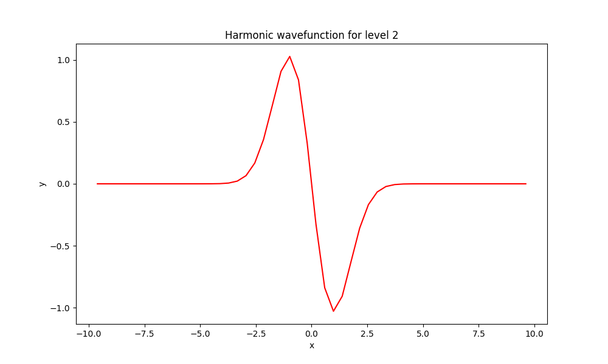
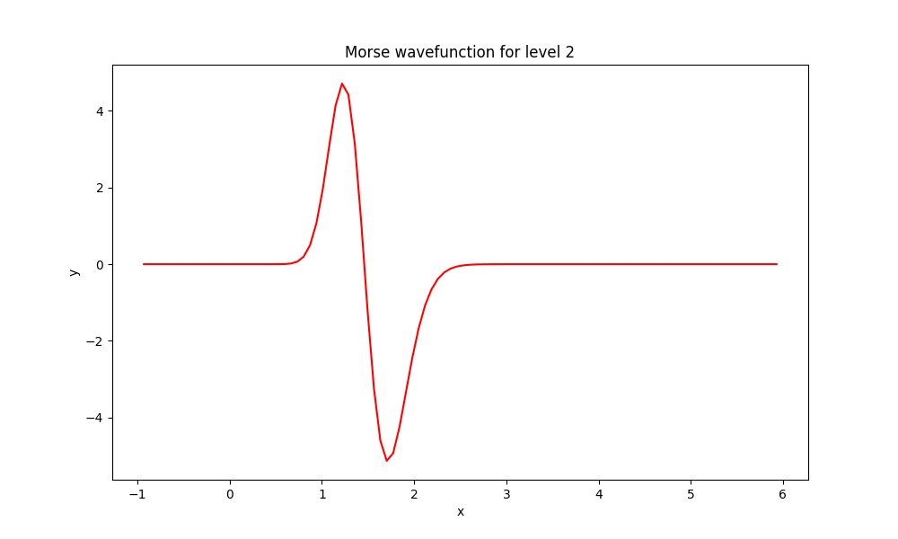
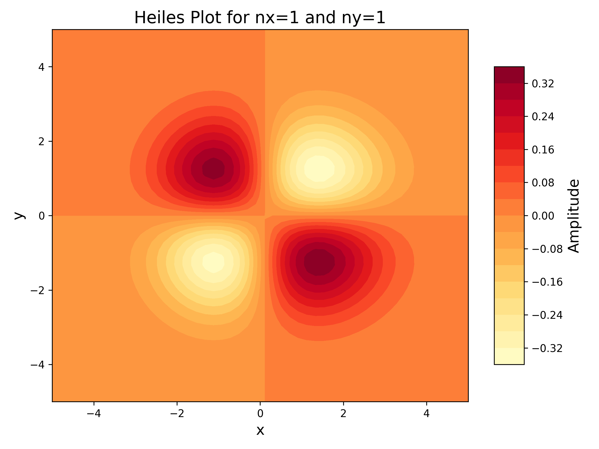

# DVR Class
This is a 1D DVR (Discrete Variable Representation) class for Fortran. You can use this module in your code to calculate DVR wavefunctions and eigenvalues after defining the potential function

## Dependencies

* Fortran2003: this code used some features in Fortran2003, like `associate` and `abstract interface`.
* LAPACK: we use the `dsyev` to diagonalize the Hamiltonian matrix.

## How to use
1. You need to define the **potential function**, like:
    ```Fortran
    function harmonic(x) result(res)
        real(8), intent(in) :: x
        real(8) :: res
        res = 0.5D0 * x**2
    end function 
    ```
2. State the DVR_Class type, like
    ```Fortran
    type(DVR_Class) :: dvr_harmonic
    ```
3. Initialize the DVR class, using `DVR_init(GridsNumber, lefta, rightb, MassInAU, potential)`

    **GridsNumber**: the number of grids, `Integer`

    **lefta, rightb**: The interval [a,b], `Real(8)`

    **MassInAU**: reduced mass in a.u., `Real(8)`

    **potential**: potential function

    There is an example:
    ```Fortran
    ngrid = 50
    lefta = -10.0D0
    rightb = 10.0D0

    call dvr_harmonic%DVR_init(ngrid, lefta, rightb, 1.0d0, harmonic)
    ```
4. To perform DVR calculations, call `DVR_matrix_calc` and `DVR_diagH` as follows
    ```Fortran
    call dvr_harmonic%DVR_matrix_calc()
    call dvr_harmonic%DVR_diagH()
    ```
    You can access the following information: 

    |T|V|H|C|E|grid|weight|TransMat|
    |-|-|-|-|-|----|------|--------|
    |Kinetic Matrix|Potential Matrix|Hamiltonian Matrix|Coefficient Matrix|Eigenenergies|Grids|weight|Transform Matrix|
    |ngrid*ngrid|ngrid*ngrid|ngrid*ngrid|ngrid*ngrid|ngrid|ngrid|-|ngrid*ngrid|
    |Real(8)|Real(8)|Real(8)|Real(8)|Real(8)|Real(8)|Real(8)|Real(8)|

    **NOTE**: `C` is not the eigenvector of `H`, it equals to the eigenvector divided by the square root of the weights.

## Examples
In `DVR_test.f90`, we provide three examples.
### 1D Harmonic Oscillator
Potential function: 
```math
V(x) = \frac{1}{2} m\omega^2 x^2
```
where $m=1, \omega=1$, the results are:
```
Harmonic Oscillator Eigenenergies in Hartree:
n =    0  E_DVR =        0.50000
n =    1  E_DVR =        1.50000
n =    2  E_DVR =        2.50000
n =    3  E_DVR =        3.50000
n =    4  E_DVR =        4.50000
n =    5  E_DVR =        5.50000
```

### Morse Potential for $\mathrm{H}_2$
Potential function: 
```math
V(x) = D_e(1-\mathrm{e}^{-\alpha(x-r_e)})^2
```
where $De=4.7446eV, r_e=0.7416\AA, \alpha=1.9426\AA^{-1}$, the results are:
```
Morse Potential Eigenenergies for H2 in eV:
n =    0  E_DVR =        0.26860
n =    1  E_DVR =        0.78232
n =    2  E_DVR =        1.26474
n =    3  E_DVR =        1.71585
n =    4  E_DVR =        2.13566
n =    5  E_DVR =        2.52417
```

### 2D Henon-Heiles Potential
Potential function:
```math
V(x,y)=\frac{1}{2}(x^2+y^2)+\sqrt{0.0125}(x^2y-\frac{1}{3}y^3)
```
the results are:
```
Henon-Heiles Potential Eigenenergies in Hartree:
n1 =    0  n2 =    0  E_DVR =        1.42460
n1 =    0  n2 =    1  E_DVR =        2.83102
n1 =    1  n2 =    0  E_DVR =        2.85317
n1 =    1  n2 =    1  E_DVR =        4.25960
```

